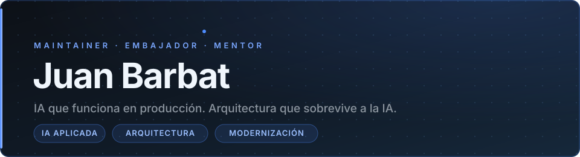

# Juan Barbat

  

  <strong>IA que funciona en producción. Arquitectura que sobrevive a la IA.</strong>

  
  
  
  
  

---

## Quién soy

Integro capacidades de IA en sistemas que ya tienen usuarios, deuda técnica, restricciones de seguridad y necesidad de mantenimiento. El objetivo no es sumar IA por tendencia: es resolver un problema concreto sin deteriorar la arquitectura.

**Maintainer** del ecosistema [Gentle AI™](https://github.com/Gentleman-Programming/gentle-ai) · **Embajador** de [NaN.Builders](https://nan.builders/)

---

## Ecosistema Gentle AI™

Proyectos que mantengo y desarrollo:

| Proyecto | Qué es |
| --- | --- |
|  | La distribución completa de disciplina de ingeniería para agentes de código. |
|  | Shell para trabajo controlado con agentes. |
|  | Memoria persistente para agentes de código. |

Como [embajador de NaN.Builders](https://cloud.nan.builders/r/VNJPBRVM) acompaño la adopción de su plataforma de modelos para agentes en la comunidad hispanohablante.

---

## RefactorIA

Comunidad en español para developers que migran hacia stacks modernos e integran IA con criterio técnico. Código real, sin demos de marketing.

| Plataforma | Link |
| --- | --- |
| 🌐 Sitio | [refactoria.dev](https://refactoria.dev) |
| 📺 [RefactorIA Labs](https://www.youtube.com/@RefactorIA) | Laboratorios, experimentos e integraciones con evidencia práctica. |
| 📺 [RefactorIA Devs](https://www.youtube.com/@RefactorIADevs) | Práctica profesional, arquitectura y modernización. |
| 💬 [Discord](https://discord.gg/PT5EHv6nMM) | La comunidad, día a día. |
| 🐙 [GitHub](https://github.com/refactor-ia) | Repositorios y trabajo rastreable. |

---

## Colaboración

Ofrezco [mentoría individual sobre IA](https://barbat.dev/mentoria) y consultoría para evaluar, diseñar o implementar soluciones sin comprometer arquitectura, seguridad ni mantenibilidad.

<strong>Trabajo profesional y confidencialidad</strong>

> Mi trabajo principal para empresas se realiza a través de InnIT-SAS. Muchos de esos sistemas y repositorios son privados por razones normales de confidencialidad profesional: pertenecen a clientes, contienen contexto operativo sensible o no fueron concebidos como proyectos públicos.
>
> Por eso este perfil no pretende representar volumen de contribuciones open source. Los repositorios públicos disponibles son una muestra acotada; el criterio de trabajo está en construir, mantener y mejorar software que funcione bajo condiciones reales.

---

## Contacto

  ¿Una necesidad concreta de IA, arquitectura o modernización? 
  

---

  

